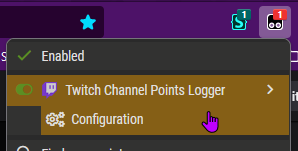

# channel point userscript thing

TODO:

- auto-detect the login token
- have some sort of FTUE that shows the login dialog and asks you the streams to log

## install

[Install userscript](https://pointypoints.xorus.dev/userscript/twitch-channel-points-logger.user.js?nocache)

Please check the backend server privacy policy: https://github.com/xorus/pointypoints#privacy

TL;DR: I don't want none of your data and collect nothing apart the actual (point; channel) values.

It will then create a configuration menu in your userscript extension, here I am using TamperMonkey:



Make sure you are on a twitch stream page (or pop-out chat) if you don't see the "Configuration" button.

the login process is a little archaic for now, BUT

Clicking on it will open a settings dialog, and you can then click on the login button. It will open a pop-up that
will allow you to login via Twitch. The login process will be handled by my server.

After the login, a token will be displayed, and you will have to copy and paste it manually in the "Advanced" section
"Auth Token" field. (this will be automated in the future)

## how it works

how does it read points:

`src/watcher.ts`

1. simulates a mouseover event on the channel point button
2. waits a bit and searches for the channel point tooltip
3. reads the tooltip contents to extract the exact number value
4. it the point count is different from the last read, it sends it to the server

### backend

There are two backend options implemented

#### custom webhook

`src/backend/WebhookBackend.ts`

POST http://your.tld/url/you/set/in/options

sent body example:

```json
{
  "value": "123456",
  "channel": "dougdoug"
}
```

#### webservice

`src/backend/WebServiceBackend.ts`

Basically the same but with a fixed URL and authorization system that points to my app.

TODO: add an option in config to change the webserver endpoint to be able to self-host without recompiling the script

## setup and build

Just `npm install`, `pnpm install` or `yarn install` depending on your favourite node package manager.

- `npm run build` to compile once
- `npm run watch` to compile on every change, useful when working on the python app
- `npm run serve` to open up a dev server, useful if you're only editing this script and want a quick way to edit it

  You can just install the userscript from the dev server and click on the version number in tampermonkey to
  automatically download your updated version.

## privacy

Your point counts will be sent to the server everytime a change is detected and everytime you load a twitch channel page
with a point count button on it.

You can limit the channels to send in the settings.

Sent data only contains:

- channel name
- point count

The login button will open a pop-up to my websevice Twitch Auth.
The webservice only uses this to regroup your points and allow you to consult your logged data (and not everyone
else's).

Check the webservice privacy info:
https://github.com/xorus/pointypoints

Some metadata might be logged in server logs / crash logs.
I also will use Cloudflare to cloak requests to my server.

WebService info:
https://github.com/xorus/pointypoints
